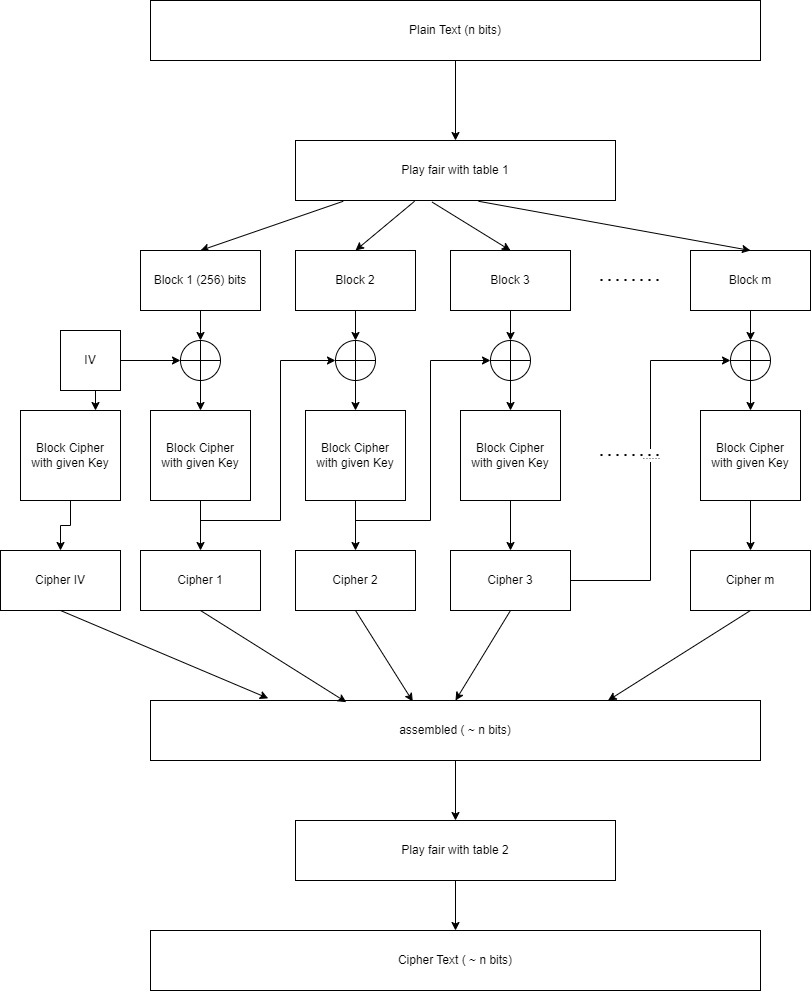
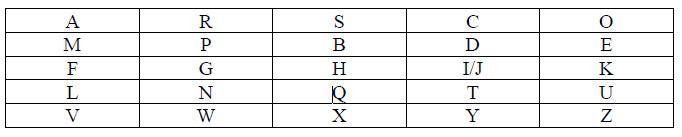
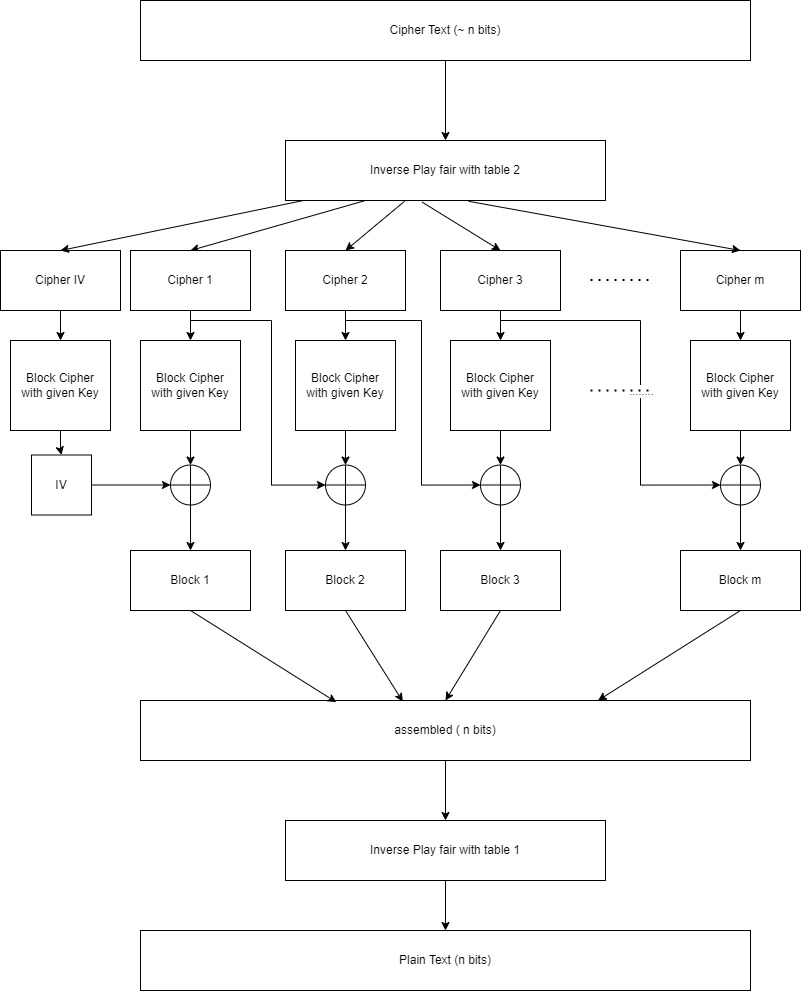
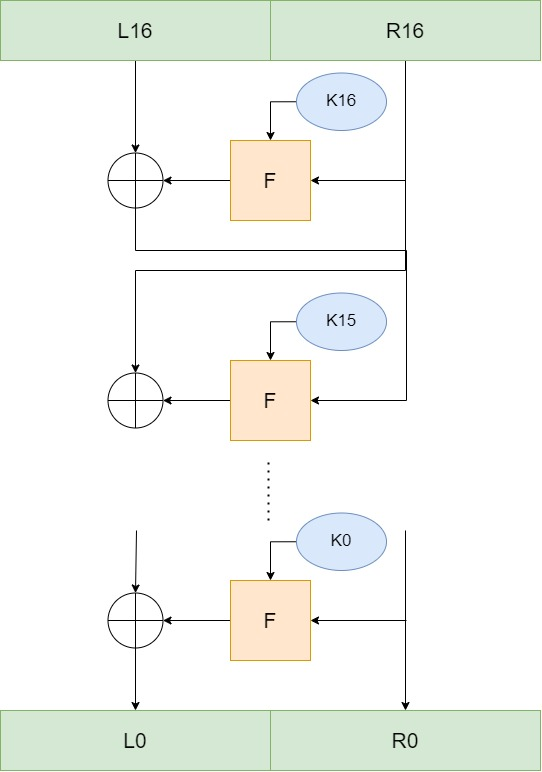
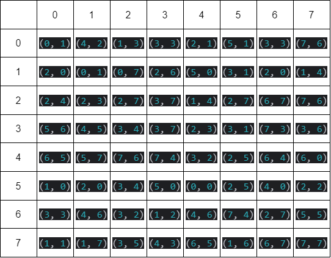
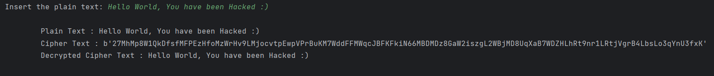

# New DES
This project demonstrates a python implementation of a simple block cipher algorithm. The algorithm is designed by me and it is based on Feistel cipher And It encrypts data longer than a single block size in CBC mode. For more information about the design, please read the document below.

## Design
The algorithm uses 256 bit block sizes and 128 bit key size, the structure of the encryption algorithm is as follows:

  

As you can see the plain text is first encrypted using play fair cipher with the key showed below:

  

After that it is sliced into blocks and passed throught block ciphers (they are calculated in CBC mode). Then, the results of block encryptions are aggregated and again passed throught another play fair cipher with a different key:

  

This, was the encryption procedure, for decryption we pretty much do the same but, in the opposite direction:

  

In each block cipher, is 16 rounds of feistel network, just like the picture below:

  
  

Again, for the block ciphers used in the decryption, every thing is the same except for the opposite directino of operations.

In every feistel function (F in the pictures), first, the input data is passed throught an S_box, then, it is XORed with the round key in order to calculate the output of the function:

  

The S_box is a window of 6 bits long itterating throught the input bit by bit, it changes the value of the window according to the table below. Here is the substitution procedure:

  1. Pick the first 3 bits of the window, the value selects the row in the table below.
  2. Pick the second 3 bits of the window, the value selects the column of the table.
  3. Change the first 3 bits with the first value of the tuple selected by steps 1 & 2.
  4. Change the second 3 bits with the second value of the tuple.
  5. Move the window one bit to the right.

  

## Result
A simple test of the algorithm is shown below, you can read the code for detailed structures and algorithms used for this self made block cipher.

  

